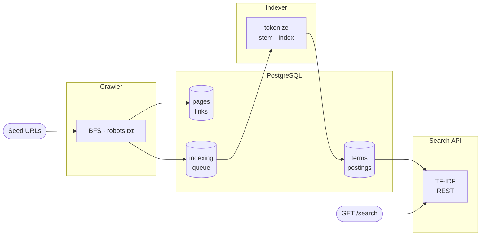

# FunFetch

A search engine built from scratch in Java. FunFetch crawls the web,indexes content into an inverted index, and serves ranked results over a REST API.

https://github.com/user-attachments/assets/9ebd1f8a-7369-4a18-bbfe-9c845e393863

## Architecture



## Quick Start

**Prerequisites:** a PostgreSQL database (Postgres is not included in docker-compose)

```bash
git clone https://github.com/suryadeepkoduri/fun-fetch.git
cd fun-fetch
cp .env.example .env

# fill in DB_URL, DB_USER, DB_PASSWORD
```

### With Docker (recommended)

```bash
docker-compose up --build
```

All three services start. The schema is created automatically by Flyway on first run.

### Without Docker

```bash
mvn clean package -DskipTests
 
java -jar search-api/target/search-api-1.3.0.jar
java -jar crawler/target/crawler-1.3.0.jar
java -jar indexer/target/indexer-1.3.0.jar
```

## Usage

```
GET /search?q=<query>&limit=<n>
```

```bash
curl "http://localhost:8080/search?q=java+streams&limit=5"
```

```json
[
  {
    "id": 42,
    "url": "https://example.com/java-streams-guide",
    "title": "Java Streams — A Complete Guide",
    "score": 6.21
  }
]
```

## Contributing

Suggestions, bug reports, and pull requests are welcome. [Open an issue](https://github.com/suryadeepkoduri/fun-fetch/issues) to discuss what you'd like to change before submitting a PR
